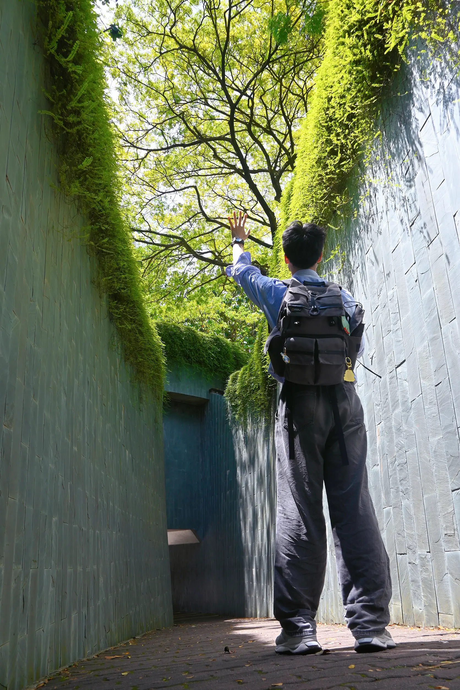
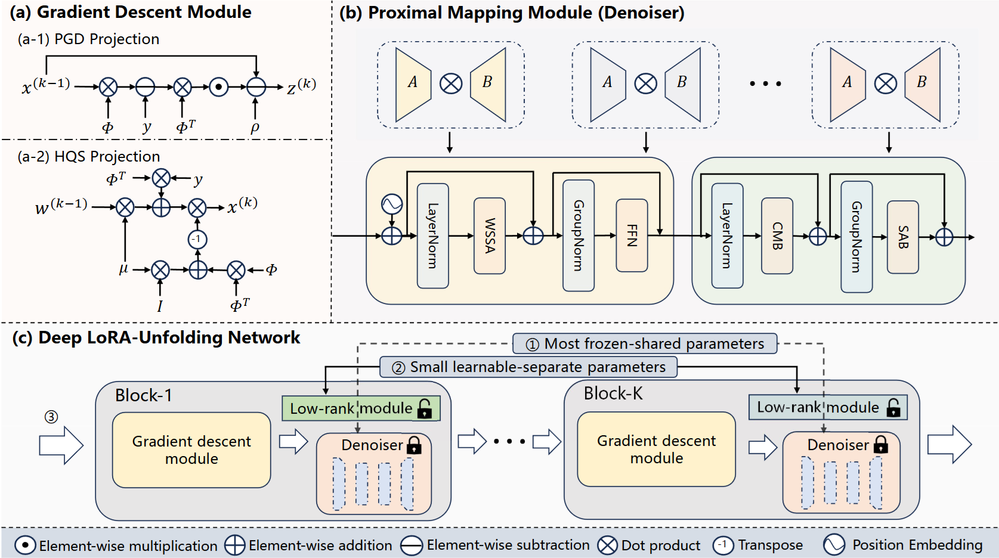
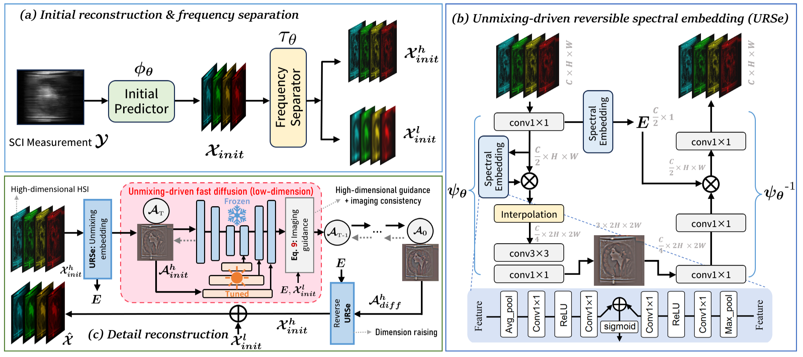

---
layout: page
---

# About Me

I am **Benteng Sun (孙奔腾)**, an undergraduate student in Data Science (Mathematics Category) at **Harbin Institute of Technology, Shenzhen** (graduating in 2026). My research centers on machine learning, sparse representation, and computational imaging, advised by [Prof. Yongyong Chen](https://scholar.google.com/citations?user=ny2mn-cAAAAJ).

I have published at **ICLR** and participated in top-tier competitions. Currently, I am exploring efficient and controllable generation paradigms, aiming to build scalable frameworks for images, videos, and 3D content.

📧 Contact: <a href="mailto:SMARK2019@outlook.com"><strong>SMARK2019@outlook.com</strong></a>

---

## Research Interests

- **Multimodal Understanding & Generation** — cross-modal synthesis, language-guided visual generation, modality fusion

- **Generative Modeling & Controllable Generation** — structure-guided diffusion, efficient sampling, scalable 2D/3D/video frameworks

- **Computational Imaging & Low-Level Vision** — spectral imaging, MRI acceleration, physics-driven restoration, compressed sensing

---

## Selected Publications

  
Deep LoRA-Unfolding Networks for Image Restoration

  
Xiangming Wang, Haijin Zeng, <strong>Benteng Sun</strong>, Jiezhang Cao, Kai Zhang, Qiangqiang Shen

  
IEEE TIP 2026 · IF 10.6

  

    

      
    

    

      A novel deep unfolding framework that introduces stage-specific LoRA adapters to dynamically modulate denoising behavior across unfolding stages. Achieves N× parameter reduction for N-stage networks while maintaining on-par or better performance across multiple image restoration tasks. 
      <small><em>Keywords: deep unfolding, low-rank adaptation, image restoration</em></small>
    

  

  

    <a href="https://ieeexplore.ieee.org/document/11391488" target="_blank">📄 Paper</a>
  

  
Spectral Compressive Imaging via Unmixing-driven Subspace Diffusion Refinement

  
Haijin Zeng*, <strong>Benteng Sun</strong>*, Yongyong Chen, Jingyong Su, Yong Xu

  
ICLR 2025 Spotlight · Top 4.79%

  

    

      
    

    

      A novel subspace diffusion refinement framework for spectral compressive imaging, recovering high-frequency details from minimal measurements. Achieved 38.14 dB PSNR on KAIST dataset with 10× speedup over existing diffusion models. 
      <small><em>Keywords: spectral imaging, sparsity modelling, diffusion refinement</em></small>
    

  

  

    <a href="https://openreview.net/pdf?id=Q150eWkQ4I" target="_blank">📄 Paper</a>
    <a href="https://github.com/SMARK2022/PSR-SCI" target="_blank">💻 Code</a>
    <a href="project/PSR-SCI/index.html" target="_blank">🌐 Project</a>
  

---

## Competitions & Projects

- **The 19th "Challenge Cup" National Competition** First Prize
   Achieved over 95% accuracy in radar-infrared fusion object detection under limited-sample, noise-intensive conditions.

- **NTIRE Challenge (CVPR 2025)**
   Developed a diffusion-based image restoration system, compressing model parameters from 1.77B to 2.2M while retaining high visual quality.

- **SMARK Media Tools** Open Source
   GPU-accelerated photography management toolbox with intelligent grouping and aesthetic scoring. [💻 GitHub](https://github.com/SMARK2022/electron-media-toolbox)

- **MetaMusic: Cross-Modal Music-Driven Visual Generation** Top 1/83
   Cross-modal generation pipeline using CLIP embeddings for music-to-image translation. [💻 Project](https://github.com/SMARK2022/MetaMusic)

---

## Honors & Awards

<ul class="award-list">
  <li><strong>First Prize (National)</strong>, "Challenge Cup" — MoE, PRC, 2024</li>
  <li><strong>Meritorious Winner (Top 6%)</strong>, Mathematical Contest in Modeling — COMAP, USA, 2024</li>
  <li><strong>First Prize</strong>, 15th Chinese Mathematics Competition, 2023</li>
  <li><strong>Champion (1/83)</strong>, Freshman Annual Research Project — HITSZ, 2023</li>
</ul>

### Scholarships

<ul class="award-list">
  <li><strong>National Scholarship (Top 0.2%)</strong> — MoE, PRC, 2024–2025</li>
  <li><strong>High-Level Innovation Award (Top 0.1%)</strong> — HIT, 2024 (Awarded 50,000 RMB)</li>
</ul>